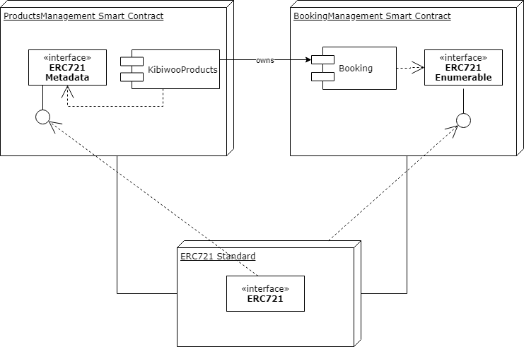
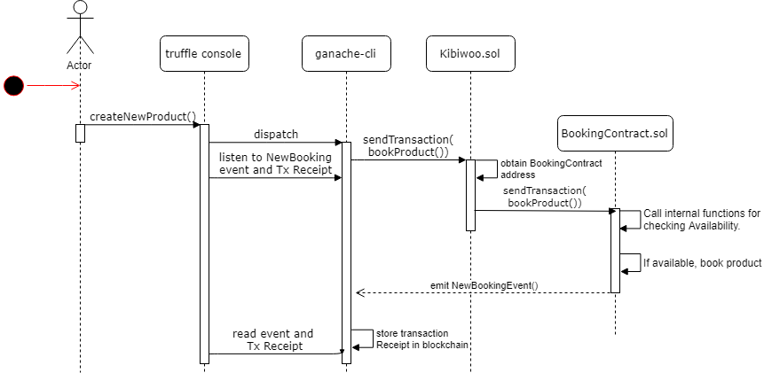
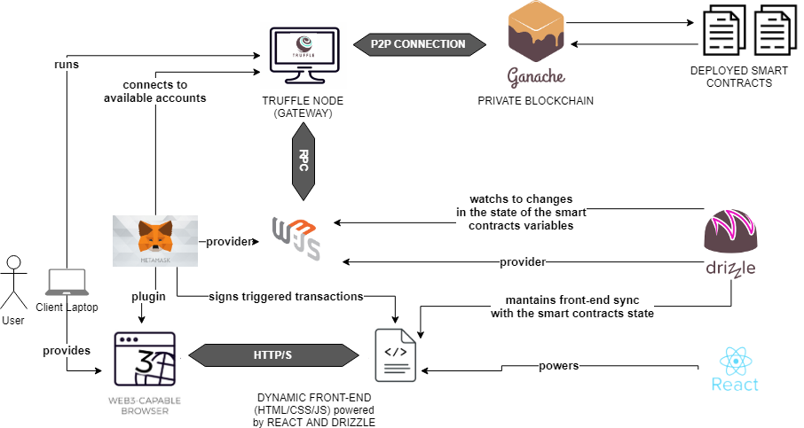

# BLOCKCHAIN KIBIWOO

- This Project aims to develop and deploy a series of smart contracts that allow to migrate a booking system logic to a decentralized environment based in Blockchain technology. 
- It also develops a decentralized application that acts as a proof of concept of the solution.
- For testing the smart contracts a TDD/BDD coding style has been implemented using Mocha and Chai JS libraries.

This will allow to disrupt the booking industry, which is highly controlled by big marketplaces such as Booking or Airbnb. These actors have leverage that power in order to impose tough conditions which have adversely affect the quality of services provided within this industry.

The idea is to tokenize both the products to be booked as well as the timeframes for each products so that we can handle independently the products rights and transfer accesibility and also the bookings times.

## Objectives

- Design and Development of Smart Contracts using Solidity programming language for handling a booking logistic in a Blockchain Environment. OOP development model used.
- Development of Smart Contracts compliance with Ethereum token standards and using the less posible private software. Study and implementation of ERC-721 Ethereum Standard.
- Set-up and confguration of a local Blockchain. Set-up and configuration of an Ethereum Full-Node using Parity.
- Dapp development for interacting with the deployed Smart Contracts via a Frontend.
- Deployment of the Smart Contract in Ropsten Ethereum Testnet. Adjustment and deployment in Alastria Blockchain.
- Implementation of Agile Software Development Technologies.
- Implementation of coding best practices, code documentation and code testing.
- Proper analysis of trade-off balance between business needs and full blockchain architecture implementation.

## Technologies Used

The following technologies have been used throughout the project:

1. **Ethereum Blockchain**: The Smart Contracts have been deployed to the Ethereum Blockchain. Specifically, they have been deployed to the Ropsten Ethereum Testnet.
2. **Parity**: Ethereum Blockchain Client written in Rust.
3. **Truffle Developer Tools**: They have been used for the development of the smart contracts in Solidity.
    - __*Ganache*__: Private Blockchain for testing solidity contracts.
    - __*Drizzle*__: For synching the dapp front-end with the Ethereum Blockchain state.
4. **Solidity**: High-level programming language for Etheruem Smart Contracts.
    - __*Open-Zepelin*__: Solidity well documented and tested libraries as well as open source implementations of ERC Ethereum standards.
5. **Web3.js**: JavaScript Libraries for communicating with the an Ethereum node through an API.
6. **Metamask**: Browser extension for managing Ethereum Accounts and keys.

## Contracts

All Solidity contracts are under the `contracts/` folder.

- __KibiwooRegisterProducts.sol__: Contract for handling the registering of shop's products for making them visible for bookings.
- __KibiwooManageProducts.sol__: Extends registerProducts contract for including also management of product's complements.
- __KibiwooHelperProducts.sol__: Extends manageProducts conract for including helper functions to obtain information about shop's products.
- __KibiwooOwnership.sol__: ERC721 implementation of adapted to Kibiwoo's products as the NFTs. Extends KibiwooHelperProducts and also implements ERC165 standard.
- __BookingContract.sol__: Contract for handling the timeframes for each product independently to the NFTs for the products. Implements the ERC721 standard.
- __Kibiwoo.sol__: Main implementation that comprises and joins both the tokenization of the products as well as the tokenization of the timeframes.
- __Migrations.sol__: Contract for managing the migrations and deployments of the smart contracts to the Blockchain using Truffle.

You can see in the following figure the design of the solution:

You can see also the UML design for the booking use case as an example of how the smart contracts have been designed and implemented:

## Dapp Implementation

We have used drizzle, Metamask and web3.js to connect our front-end to the smart contracts deployed in the network. You can see in the following figure the architecture of the solution:

As well, you can see a screenshot of the front-end solution in the following image:

Then, you can see how each time you try to book a product, the solution if the product is available for booking will try to connect to your Ethereum account and ask for the confirmation of the transaction as seen in the following image:

Finally you can see how after the transaction has been confirmed, the product will now not be available for booking it as een in the following figure:

## Sources

__Development of Solidity Smart Contracts__

There are several implementations of booking platforms using Smart Contracts, and even several standardization have been proposed. The project inherits several characteristics from the following implementations:
- [ERC-809: Renting Standard for Rival, Non-Fungible Tokens](https://github.com/ethereum/EIPs/issues/809)
- [ERC-1201: Two Tiered Token Structure for Non-fungible Asset Ownership and
Rental Rights](https://github.com/ethereum/EIPs/issues/1201)
- [BTU Token Protocol] (https://github.com/btuprotocol)
- [OpenZeppelin ERC721 Implemention](https://github.com/OpenZeppelin/openzeppelin-contracts/blob/master/contracts/token/ERC721/ERC721.sol)

As a differentiation to those implementations, our project aims to develop a series of smart contracts which do not rely in any private token as the currency within the system, and which prioritizes the use of existing ethereum standards such as ERC20 or ERC721 in its design and smart contracts, so that the resulting system is interoperable and does not rely excessively in any component. We will take into account economic aspects for deciding what parts must operate exclusively on the Blockchain and what parts should be maintained offchain.

__Development of Dapp Front-End__

- [Proof of Concept of ERC809/1201](https://github.com/saurfang/meeteth
